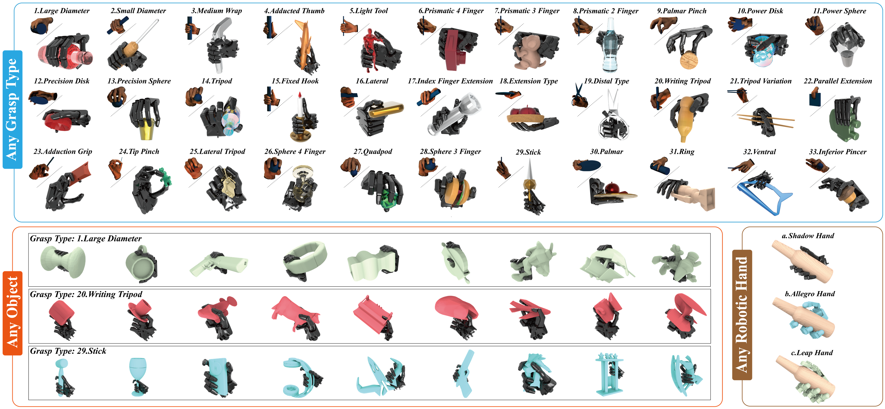

# Dexonomy

[Project Page](https://pku-epic.github.io/Dexonomy) | [Paper](https://arxiv.org/abs/2504.18829) | [Dataset](https://huggingface.co/datasets/JiayiChenPKU/Dexonomy/tree/main) | [Learning](https://github.com/JYChen18/DexLearn)

## Overview

<div style="text-align: center;">
    
</div>

Our algorithm synthesizes **contact-rich, penetration-free, and physically plausible** dexterous grasps for:
- Any grasp type
- Any object
- Any articulated hand

All starting from just **one** human-annotated template *per hand and grasp type*.

## Supported Features
- Hands: Shadow, Allegro, Leap, MANO, Unitree_G1
- Object Scenes: Single (floating & tabletop), Clustered (light clutter)
- Object Assets: Rigid objects (ShapeNet & Objaverse), Articulated objects (PartNet)
- Physics Simulator: MuJoCo
- Grasping Trajectory Synthesis: cuRobo integration

TODO: add scene_cfg examples for articulated objects, clutter scenes, and other tasks.


## Installation
Our code is tested on **Ubuntu 20.04** with **NVIDIA RTX 3090** GPUs. 

```bash
git submodule update --init --recursive --progress

conda create -n dexonomy python=3.10 
conda activate dexonomy
pip install -e .
```

(Optional) BODex is only used for collision-free grasping trajectory synthesis. Currently, we only provide support for UR10e + shadow hand.

```bash
cd third_party/BODex
sudo apt install git-lfs
git lfs pull
pip install -e . --no-build-isolation
cd ...
```

## Quick Start
### 1. Prepare Object Assets 

Download our pre-processed object assets `DGN_5k_processed.zip` from [Hugging Face](https://huggingface.co/datasets/JiayiChenPKU/Dexonomy), and organize the unzipped folders as below. 
```
assets/object/DGN_5k
|- processed_data
|  |- core_bottle_1a7ba1f4c892e2da30711cdbdbc73924
|  |_ ...
|- scene_cfg
|  |- core_bottle_1a7ba1f4c892e2da30711cdbdbc73924
|  |_ ...
|- valid_split
|  |- all.json
|  |_ ...
```
Alternatively, you can pre-process your own object assets using [MeshProcess](https://github.com/JYChen18/MeshProcess).

### 2. Synthesize Grasps
Run the following commands to synthesize grasps for a specific grasp type:
```bash
dexrun op=tmpl  # Convert human annotations to valid templates
dexsyn 'tmpl_name=[1_Large_Diameter]' # Run the script for complete synthesis pipeline
```
where `dexrun` is the alias for `python -m dexonomy.main` and `dexsyn` is the alias for `python -m dexonomy.script`.

## Tutorial
For a detailed walkthrough of **template annotation** and **code usage**, please refer to [getting_started](https://github.com/JYChen18/Dexonomy/tree/main/getting_started).

## License

This work and the dataset are licensed under [CC BY-NC 4.0][cc-by-nc].

[![CC BY-NC 4.0][cc-by-nc-image]][cc-by-nc]

[cc-by-nc]: https://creativecommons.org/licenses/by-nc/4.0/
[cc-by-nc-image]: https://licensebuttons.net/l/by-nc/4.0/88x31.png

## Citation

If you find this work useful for your research, please consider citing:
```
@article{chen2025dexonomy,
        title={Dexonomy: Synthesizing All Dexterous Grasp Types in a Grasp Taxonomy},
        author={Chen, Jiayi and Ke, Yubin and Peng, Lin and Wang, He},
        journal={Robotics: Science and Systems},
        year={2025}
      }
```