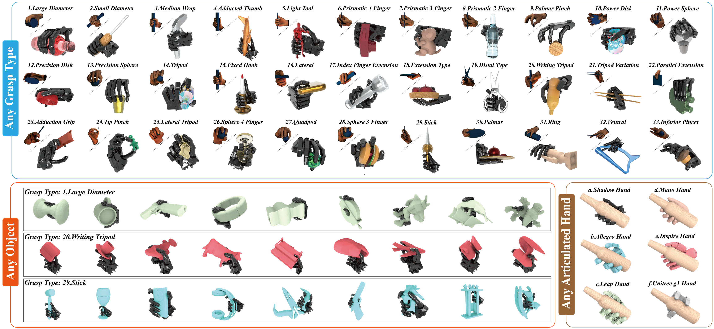

# Dexonomy

Official implementation of *[RSS 2025] Dexonomy: Synthesizing All Dexterous Grasp Types in a Grasp Taxonomy*. 


[Project Page](https://pku-epic.github.io/Dexonomy) | [Paper](https://arxiv.org/abs/2504.18829) | [Dataset](https://huggingface.co/datasets/JiayiChenPKU/Dexonomy/tree/main) | [Annotation UI Demo](https://gfrl.github.io/DexAnno/) | [Learning](https://github.com/JYChen18/DexLearn)

## Overview

<div style="text-align: center;">
    
</div>

Our algorithm synthesizes **contact-rich, penetration-free, and physically plausible** dexterous grasps for:
- Any grasp type
- Any object
- Any articulated hand

All starting from just **one** human-annotated template *per hand and grasp type*.

## Timeline

The full code of our proposed synthesis pipeline will be released late this year.

## License

This work and the dataset are licensed under [CC BY-NC 4.0][cc-by-nc].

[![CC BY-NC 4.0][cc-by-nc-image]][cc-by-nc]

[cc-by-nc]: https://creativecommons.org/licenses/by-nc/4.0/
[cc-by-nc-image]: https://licensebuttons.net/l/by-nc/4.0/88x31.png

## Citation

If you find this work useful for your research, please consider citing:
```
@article{chen2025dexonomy,
        title={Dexonomy: Synthesizing All Dexterous Grasp Types in a Grasp Taxonomy},
        author={Chen, Jiayi and Ke, Yubin and Peng, Lin and Wang, He},
        journal={Robotics: Science and Systems},
        year={2025}
      }
```
