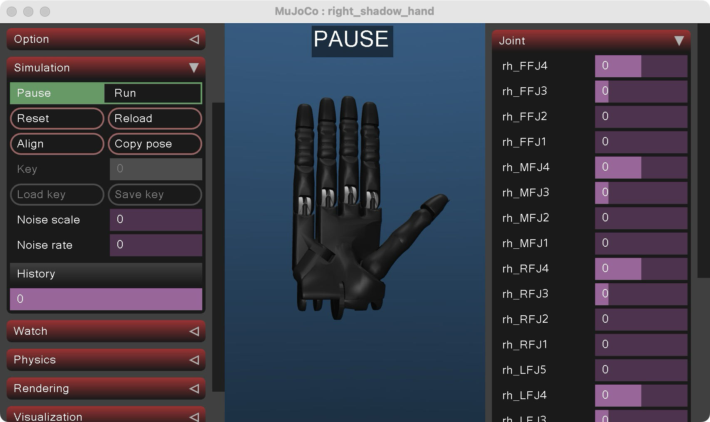
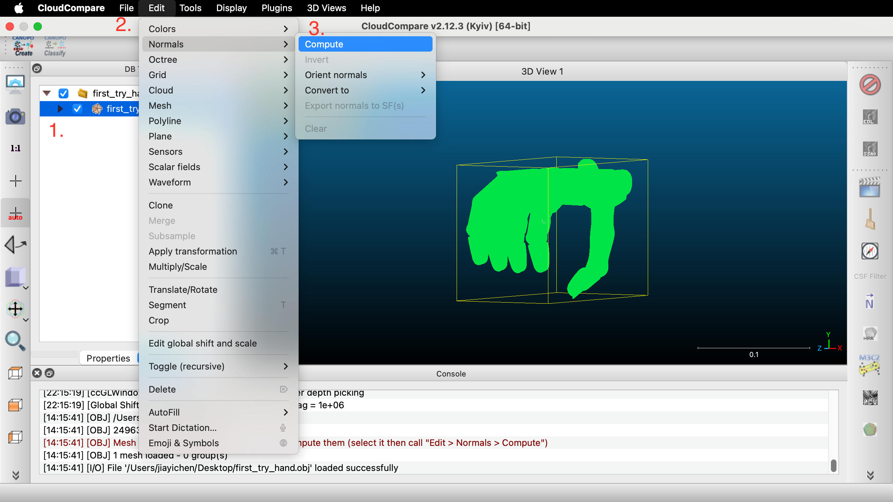
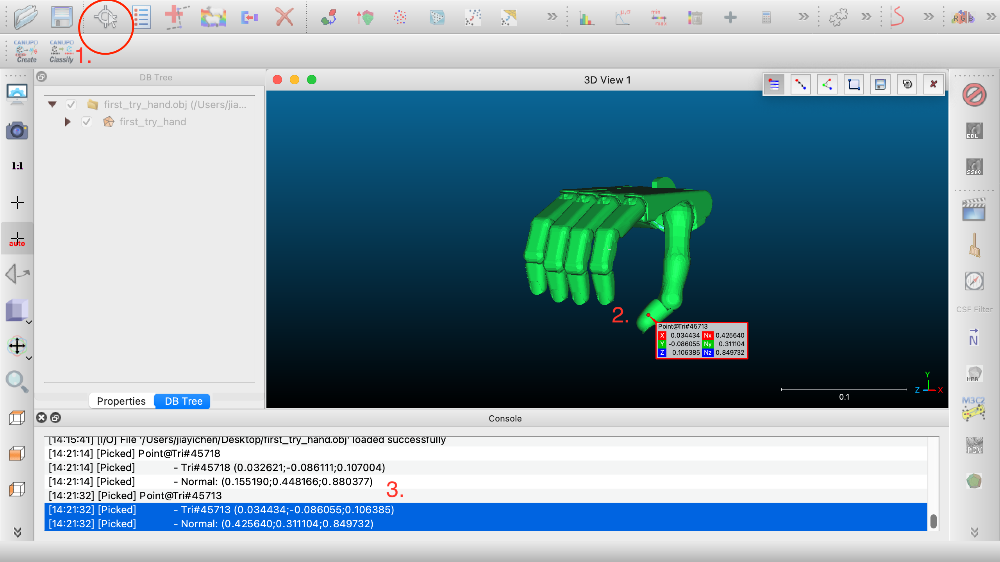
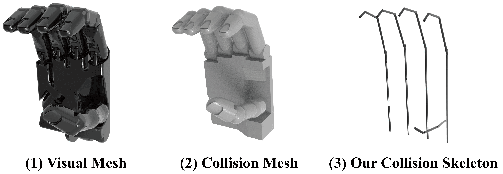

# Annotation Tutorial
This tutorial guides you through the process of adding a new hand model and annotating the necessary components—particularly for the **initial grasp template** and **hand skeleton**.


## Required Files
| ID | File Path | Description |
|--|------|-------------|
|1 | dexonomy/config/hand/new_hand.yaml | Basic configuration |
|2 | assets/hand/new_hand/right.xml | Hand XML model |
|3 | assets/hand/new_hand/body_group.yaml | Hand body groups for contact check in [syn_hand_refine.py](https://github.com/JYChen18/Dexonomy/blob/main/dexonomy/task/syn_hand_refine.py#L34) |
|4 | assets/hand/new_hand/raw_anno/${TEMPLATE_NAME}.yaml | Annotated grasp template including hand qpos and hand contacts |
|5 | assets/hand/new_hand/anno_keypoint.yaml | Optional reusable keypoints in bodyframe |
|6 | assets/hand/new_hand/collision_skeleton.yaml | Skeleton config for collision detection in [syn_object_align.py](https://github.com/JYChen18/Dexonomy/blob/main/dexonomy/task/syn_object_align.py) |

---


## Files 1-2: Hand XML Setup
We recommend starting with a hand model from the [MuJoCo Menagerie](https://github.com/google-deepmind/mujoco_menagerie) and modifying it as needed.


**Important Notes:**

- **Adjust `kp` and `forcerange` for hand joints:**  
  Our default test object weighs 0.1 kg, so 1N of force is typically needed. Use:
  - `kp = 5` and `forcerange = [-3, 3]` as a good starting point.
  - `kp = 1` may also work, but can lead to abnormal `squeeze qpos` due to the inverse PID control used to compute joint delta from desired force.

- **Ignore `<option>` and remove `freejoint`:**  
  These are handled programmatically via [MjSpec](https://mujoco.readthedocs.io/en/stable/programming/modeledit.html) in [mujoco_util.py](https://github.com/JYChen18/Dexonomy/blob/main/dexonomy/sim/mujoco_util.py#L52).

---


## File 3: Hand Body Grouping

`body_group.yaml` defines groups of hand bodies (e.g., palm, fingers). For example, 
```yaml
body_group: [
    [rh_ffdistal,rh_ffmiddle,rh_ffproximal],
    [rh_mfdistal,rh_mfmiddle,rh_mfproximal],
    [rh_rfdistal,rh_rfmiddle,rh_rfproximal],
    [rh_lfdistal,rh_lfmiddle,rh_lfproximal],
    [rh_thdistal,rh_thmiddle,rh_thproximal],
    [rh_palm,rh_lfmetacarpal]
]
```

This is used to **relax contact requirements**. 

Originially, every hand body with a contact annotation is required to be in contact with the object, but it is too strict. By using body groups, we relax the condition to *hand bodies with a contact annotation in the same group only require that at least one of them is in contact with the object*.


## File 4-5: Initial Grasp Template

### Annotate hand qpos in MuJoCo



1. (Optional) Add a [keyframe](https://mujoco.readthedocs.io/en/stable/XMLreference.html#keyframe) into XML and load it.
2. Use the `Joint` panel to adjust joints, or `Control` panel during simulation.
3. Use `Copy pose` to get hand qpos and save to `raw_anno/first_try.yaml` like:
```yaml
qpos: [-0.017, 0.47, 0.74, 0.74, -0.02, 0.49, 0.74, 0.74, 0.03, 0.47, 0.74, 0.74, 0.0, 0.05, 0.36, 0.74, 0.74, 0.1, 1.22, 0.16, 0.11, 0.7]
```
4. To generate the 3D mesh and visualize it:
```bash
python -m dexonomy.main hand=new_hand task=anno2temp
python -m dexonomy.main hand=new_hand task=vis_3d task.data_type=init_template
```

### Annotate contact points and normals in [CloudCompare](https://www.danielgm.net/cc/)

<details>

<summary>Option A: Annotate in handframe (direct method)</summary>

1. Load the posed hand mesh into CloudCompare and compute the *per-triangle* normals.

2. Use the *point picking* tool to select a contact point and get its corresponding normal.

3. Copy them into `raw_anno/first_try.yaml` like:
```yaml
contact:
  rh_thdistal: [0.034434,-0.086055,0.106385,0.425640,0.311104,0.849732]
```

</details>

<details>
<summary>Option B: Annotate in bodyframe (reusable)</summary>

1. Export all hand body meshes:
```bash
python -m dexonomy.main hand=new_hand task=vis_3d task.data_type=init_template task.hand.init_body=True
```
2. Load one mesh into CloudCompare and annotate keypoints as in *Option A*.
3. Copy them into `anno_keypoint.yaml` like:
```yaml
rh_ffdistal: [
  [-0.000057, -0.0067  ,  0.018496, -0.000913, -0.989521,  0.144385],
]
```
4. Then, use it in `raw_anno/first_try.yaml` like:
```yaml
contact:
    rh_ffdistal: 0   # Select 0-th keypoint for this body
```
</details>

To visualize the annotated contacts:
```bash
python -m dexonomy.main hand=new_hand task=anno2temp
python -m dexonomy.main hand=new_hand task=vis_3d task.data_type=init_template task.hand.contact=True
```
`anno2temp` will also automatically check for mismatches between annotated contact points and body names — a common issue in practice.

**Important Notes:**
- YAML files do not support duplicated keys. Therefore, if a link has multiple contact points, annotate them using a list format:
```yaml
contact:
    rh_thdistal: 
      - [0.034434,-0.086055,0.106385,0.425640,0.311104,0.849732]  # Option A
      - 0   # Option B
      - 1   # Option B
```

## File 6: Hand Skeleton



Each skeleton line is a 6D vector: two 3D points that specify the start and end of a segment in the body frame. For example, 
```yaml
rh_palm: [
  [0.033, 0, 0.1, 0.033, 0, 0],
  [0.011, 0, 0.1, 0.011, 0, 0],
  [-0.011, 0, 0.1, -0.011, 0, 0],
  [-0.033, 0, 0.03, -0.033, 0, 0],
]
```

To visualize the annotated hand skeleton:
```bash
python -m dexonomy.main hand=new_hand task=vis_3d task.data_type=init_template task.hand.skeleton=True
```
